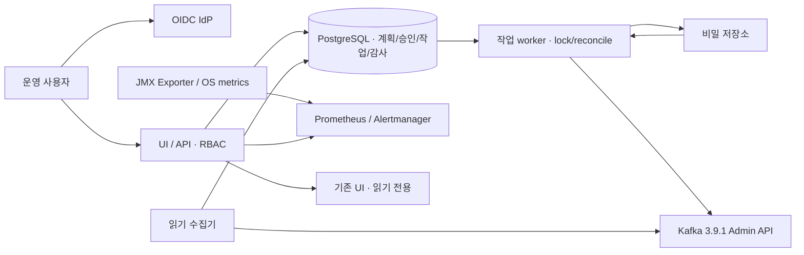
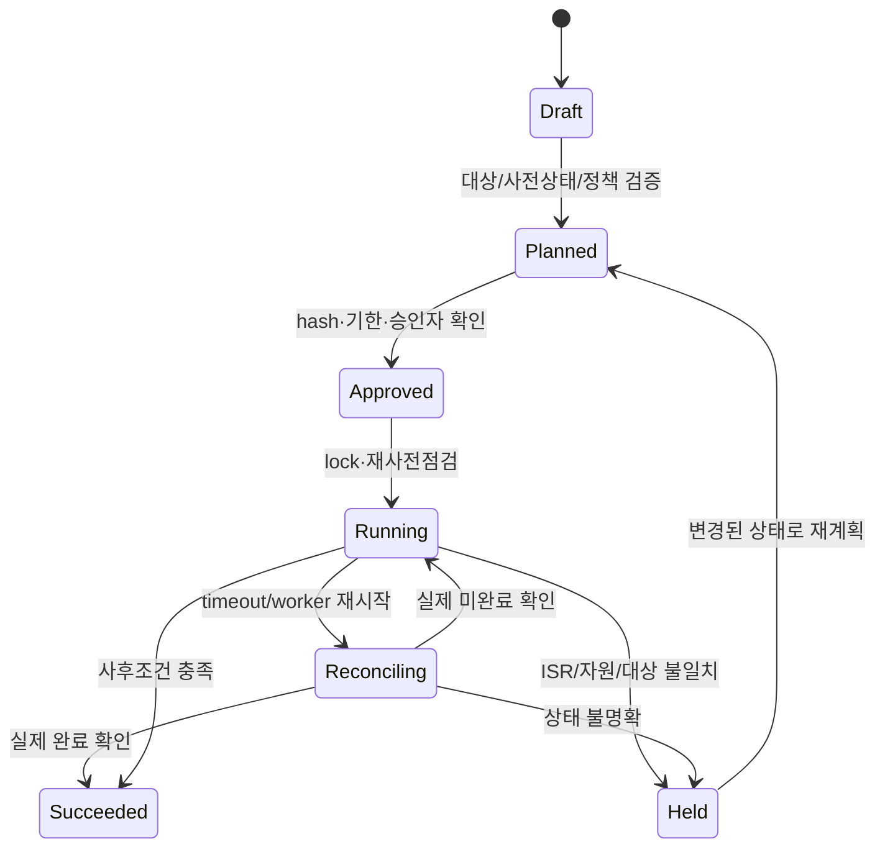

# 권장 아키텍처와 운영 변경 설계

**권장: Java AdminClient 중심의 모듈형 백엔드 + PostgreSQL 작업 상태 + 기존 UI·Prometheus 통합.** broker에 agent를 기본 설치하지 않고 읽기 수집과 쓰기 실행 자격 증명을 분리합니다. PoC는 단일 노드 systemd, 운영은 API/worker 분리와 DB 복구부터 검증합니다. 이하 내용은 설계 제안이며 구현 검증 완료 주장이 아닙니다.



## 기술 선택과 대안

| 영역 | 권장 | 대안·선택 이유 |
| --- | --- | --- |
| API/worker | JDK17 + 지원 중인 Spring Boot 계열, kafka-clients3.9.1 명시 pin | Python은 runbook·수집 보조에 편하지만 Admin/보안 API 호환 검증 부담. Go도 binding/API 범위를 별도 검증해야 함 |
| UI | 기존 UI 링크/읽기 통합, 필요한 작업 화면만 React·TypeScript | 전체 UI 신규 개발은 메시지/serde/Connect까지 범위 확대. SPA token 보관 대신 server session/BFF 검토 |
| 상태/작업 큐 | PostgreSQL transaction + lease + SKIP LOCKED | RabbitMQ 추가는 초기 규모에 과함. DB lease는 exactly-once를 만들지 않으므로 reconcile 필수 |
| 지표 | JMX Exporter·Prometheus·Alertmanager | 자체 TSDB 비권장. Grafana는 선택 사항·AGPL 검토, 핵심 화면은 Prometheus 조회도 가능 |
| 로그인 | 기존 OIDC IdP, 없으면 Keycloak 별도 평가 | 자체 사용자 암호·SSO 엔진 비권장. LDAP 직접 연결은 기존 정책·MFA·계정 비활성 반영 검토 |
| 비밀 | 기존 조직 비밀 저장소 우선 | PoC만 권한600 파일·암호화 DB+외부 key 참조. 운영은 인증·회전·감사 가능한 저장소를 선정; 자체 crypto 알고리즘 금지 |
| 배포 | tar/RPM·systemd·전용 service user·서명/해시 manifest | Docker/Kubernetes 의무 없음. Ansible은 후기 운영 승인 runbook 통합 후보 |

Spring Boot 현재 시스템 요구 문서는 Java17 이상을 제시합니다. 최종 framework patch·지원 기간·Java17 조합은 구현 착수 시 고정해야 합니다. Kafka client는 latest로 따라가지 않고3.9.1 API/태그 기준 contract test를 둡니다. 온라인3.9 Javadoc은 현재 **3.9.2**를 표시하므로3.9.1 기능 여부는 [3.9.1 Admin 소스](https://github.com/apache/kafka/blob/3.9.1/clients/src/main/java/org/apache/kafka/clients/admin/Admin.java)로 확인합니다. [A01,O04]

## 권한의 두 계층

플랫폼 사람의 OIDC subject/role → 승인 가능한 작업 정책 → cluster별 서비스 principal → Kafka ACL을 연결합니다. 플랫폼 DB의 role 변경은 Kafka ACL 변경과 같지 않습니다. 실제 앱은 별도 producer/consumer principal로 broker에 접속하며 topic과 group ACL로 통제합니다.

| 실행 주체 | 허용 범위 |
| --- | --- |
| 읽기 수집기 | 필요한 cluster/topic/group Describe·DescribeConfigs·offset 조회 권한만, topic Read는 기본 제외 |
| 토픽 worker | 승인된 이름/정책의 Create·Alter·AlterConfigs 등. Delete·내부 토픽은 기본 비활성 |
| RF worker | 재할당·throttle 관련 명령의 자원별 최소 권한, cluster 작업 lock |
| credential/ACL worker | SCRAM 및 ACL 관리에 필요한 관리 권한. 별도 저장소·worker·네트워크 경계, 일반 앱에 부여 금지 |
| 앱 producer | 승인 topic Write/Describe. idempotent/transactional 권한은 실제 옵션별3.9.1 검증 후 적용 |
| 앱 consumer | 승인 topic Read/Describe와 group Read, offsets 내부 topic 직접 Write를 주지 않음 |
| 비상 관리자 | 제한된 break-glass, 별도 인증·사용 승인·감사. 일반 플랫폼 principal을 super user로 두지 않음 |

권한 표는 역할 설계이며 최종 ACL 명령표가 아닙니다. 각 Admin 메서드에 필요한 ACL은3.9.1 보안 표·실제 deny matrix로 확정합니다. `--producer`의 Create 포함을 피하고 명시 권한을 발급합니다. 인증 없는 PLAINTEXT가 남으면 User:ANONYMOUS를 사용자별로 식별할 수 없으므로 사용자별 직접 접근 통제를 완료했다고 표시하지 않습니다. StandardAuthorizer/내부 통신·controller 권한을 안정화하기 전 ACL write 기능을 운영 활성화하지 않습니다.

## 읽기 수집 설계

Admin metadata·committed offsets·listOffsets·group 상태를 수집하고 broker/client JMX 및 OS metrics는 별도 저장합니다. Kafka Admin API는 producer 사용자별 모든 성공/실패나 실제 업무 처리 완료를 제공하지 않습니다. app client.id는 인증 주체와 같지 않으며 변경 가능하므로 보안 식별자로 사용하지 않습니다.

group별 lag는 partition end offset - committed offset을 기본으로 표시하되 read_committed/LSO, offset retention/reset, 미커밋 group, compacted log, timestamp age를 함께 기록합니다. 없는 offset·권한 거부·timeout·stale를0으로 채우지 않습니다. 실시간 group와 비활성 group을 구분합니다. 기본 주기10~30초를 PoC에서 측정해 조절하고 topic/group batch·rate limit·최대 scan·jitter를 둡니다. client.id·group label cardinality 예산과 topic 메시지 수집 비활성을 기본으로 합니다. 계측 필요한 end-to-end latency는 선택적 앱 instrumentation으로 분리합니다.

## 운영 변경 상태와 실행 규칙



1. 등록 CID와 실제 `describeCluster().clusterId()`를 비교하고 Kafka version/mode는 검증된 inventory와 quorum 조회로 확인합니다. 주소·node 수만으로 target 확인 금지.
2. 원본 assignment/config/ACL snapshot, topic ID·partition 수, ISR·quorum·용량·현재 재할당을 조회합니다. static/dynamic capability를 구분하고 API validateOnly 지원 시 이용합니다. 모든 API가 validateOnly를 제공하지 않으므로 자체 dry-run은 조회·정책·계획 생성만 보장하고 실행 성공 보장으로 표현하지 않습니다.
3. 표준 JSON 계획의 hash에 CID·원본/목표·정책 revision·허용 단계·위험·TTL을 포함합니다. secret 자체는 제외하고 secret reference/version만 기록합니다. 원본/목표와 영향 diff를 검토하고 승인자는 자신이 요청한 위험 작업을 단독 승인하지 않습니다.
4. execute 시 사전 상태를 재확인합니다. cluster/resource별 DB lock·lease·fencing token과 heartbeat를 확보합니다. RF/보안/lifecycle는 cluster 전체 lock; 외부 CLI 변경도 조회로 탐지합니다. 내부 lock은 외부 관리자를 차단하지 못합니다.
5. idempotency key와 desired-state fingerprint를 저장합니다. duplicate request는 기존 job을 반환합니다. 네트워크 timeout은 실패 확정이 아니므로 실제 Kafka 상태를 조회하고 이미 완료된 execute를 재전송하지 않습니다. API별 batch partial success도 자원별 기록합니다.
6. 큐 취소·worker 종료·서버 측 reassignment 취소를 별도 명령·상태로 구분합니다. 복구/취소 역시 새 계획·승인을 요구합니다. TTL 만료·상태 충돌·lease 손실은 자동 변경 확대 대신 보류합니다.
7. 성공은 전체 사후조건으로 판정합니다. RF 확대는 모든 partition RF/ISR·기존 replica 보존·진행 작업 없음·원래 throttle 복원을 확인합니다. 다른 관리자가 throttle를 바꿨으면 덮어쓰지 않고 충돌로 보류합니다.
8. 감사에는 사람·승인·CID 별칭·계획hash·시도·시간·결과·예외종류·전후diff를 남깁니다. secret/JAAS/config provider 값·payload를 redact합니다. DB audit는 자체적으로 불변이 아니므로 별도 수집처·append-only 권한·서명/해시 및 보관정책을 검토합니다.

자동 rollback은 기본 없음. 삭제한 topic 데이터, 증가한 partition, 암호 회전·ACL 변경, metadata.version/upgrade는 원복 명령만으로 복구되지 않을 수 있습니다. RF 감소는 최신 데이터가 어느 replica에 있는지·ISR·원본 노드 상태 확인 후 별도 승인합니다. 과거 assignment를 무조건 재적용하지 않습니다. broker restart가 필요한 보안 전환은 이번 MVP 변경 API에서 제외하고 기존 실패 A를 명시한 수동 검증 runbook으로만 연결합니다.

## 핵심 데이터 모델

| 모델 | 주요 필드·제약 |
| --- | --- |
| ClusterBinding | id, expectedClusterId, alias, endpointsRef, credentialRefs, capabilities, inventoryRevision, healthTimestamp |
| PlatformIdentity/RoleBinding | OIDC issuer+subject, cluster/tenant scope, allowedOperations, resourcePatterns, expiry |
| AppPrincipal/PrincipalBinding | 논리 앱, Kafka principal, topic/group policy, credentialRef/version, rotationStatus, owner |
| TopicPolicy | allowedPrefix, RF/minISR bounds, config allowlist, partitionLimit, delete/internalTopic policy |
| ChangePlan/ResourceSnapshot | CID, original/desired JSON, topic ID, preconditions, policyRevision, planHash, TTL, risk |
| Approval | planHash, approver, time, separationOfDuty, decision; 변경된 계획 승인 재사용 불가 |
| Job/JobAttempt | idempotencyKey, desiredFingerprint, state, leaseToken, attempts, observedState, errorCategory, timestamps |
| AuditEvent | actor/action/resource, plan/job IDs, redactedDiff, outcome, externalSinkAck; append-only 권한 |
| MetricAvailability | entity, source, sampleTime, status(ok/stale/unknown/denied), errorCategory |
| IntegrationBinding | Connect/Registry/MM2 endpointRef, capabilities, credentialsRef; 임의 URL/SSRF 차단 |

secret 평문은 모델에 저장하지 않습니다. tenant scope는 쿼리·API·worker 모두 검증하며 전역 unique와 CID 연결 제약을 DB로 강제합니다. offset/history·대량지표는 업무 DB에 무제한 적재하지 않습니다.

## API 예시 — 설계용, 실행 명령 아님

```http
GET /v1/clusters/cluster-alias/health
GET /v1/clusters/cluster-alias/groups/group-alias/lag
POST /v1/clusters/cluster-alias/plans
Idempotency-Key: request-example
```

```json
{
  "operation": "EXPAND_REPLICATION",
  "expectedClusterId": "EXPECTED_CLUSTER_ID",
  "targets": ["topic-example"],
  "desired": {"replicationFactor": 3, "preserveExistingReplicas": true},
  "policyRevision": 7
}
```

응답 설계: planId/hash·원본/목표 diff·사전조건·위험·TTL·미확정 항목. 비밀 값은 반환하지 않습니다.

```http
POST /v1/plans/plan-example/approvals
POST /v1/plans/plan-example/execute
If-Match: PLAN_HASH
GET /v1/jobs/job-example
POST /v1/jobs/job-example/hold
POST /v1/jobs/job-example/recovery-plans
```

execute는202+job ID, 동일 key는 같은 job, 상태 충돌409, 미승인/무권한403, 의존 서비스 중단503을 반환하는 설계입니다. 503/timeout으로 실제 작업이 미실행이라고 단정하지 않습니다. API 상태와 Kafka 관측 상태를 분리하고 부분 성공·unknown을 표시합니다.

## 향후 구현 모듈 구조

```text
platform/
  api/                 # 인증·권한·계획 API
  domain/              # policy·plan·job state
  kafka-adapter/       # 3.9.1 Admin API·capability
  collector/           # 읽기·lag·availability
  worker/              # lease·실행·reconcile
  integrations/        # metrics/IdP/secrets、후기 Connect/Registry
  ui/                  # 필요한 작업 화면
  db/migrations/       # model·audit·job
  deploy/systemd/      # 직접 설치·권한·설정 예제
  packaging/offline/   # lockfile·SBOM·서명·반입 manifest
  tests/               # unit/contract/integration/security/fault
  docs/                # runbook·recover·capacity
```

이 구조는 제안이며 이번에 해당 코드나 서비스를 만들지 않았습니다.
